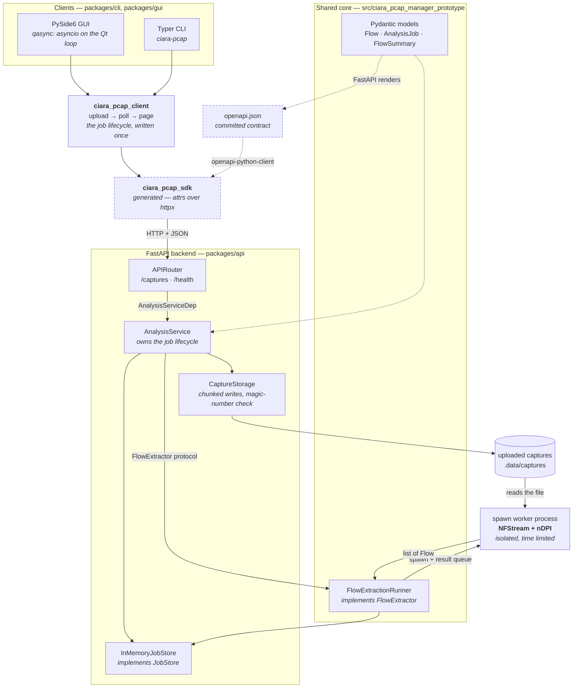

# Architecture

## System diagram



Solid edges are runtime data flow. Dashed edges are the build-time contract
path: the Pydantic models in the core package are rendered into `openapi.json`,
which generates the SDK. A client therefore cannot drift from the backend.

## Repository layout

| Path                                      | What it is                                                                                                                        |
| ----------------------------------------- | --------------------------------------------------------------------------------------------------------------------------------- |
| `src/ciara_pcap_manager_prototype/`       | Shared core. Imports no web framework, HTTP client or GUI toolkit.                                                                |
| `src/…/config.py`                         | `CoreSettings`: storage, upload limits and extraction knobs, read from `CIARA_PCAP_*`.                                            |
| `src/…/domain/flows.py`                   | `Flow`, `FlowSummary`, `FlowPage`, `ExpirationReason`. The contract's source of truth.                                            |
| `src/…/domain/jobs.py`                    | `AnalysisJob`, `JobStatus`.                                                                                                       |
| `src/…/jobs/store.py`                     | `JobStore` protocol and `JobNotFoundError`. The persistence seam.                                                                 |
| `src/…/jobs/memory.py`                    | `InMemoryJobStore`: the single-process implementation.                                                                            |
| `src/…/pcap/extractor.py`                 | Synchronous NFStream parse; maps an `NFlow` onto `Flow`.                                                                          |
| `src/…/pcap/runner.py`                    | `FlowExtractor` protocol and `FlowExtractionRunner`, which parses in a time-limited `spawn` process.                              |
| `src/…/pcap/compat.py`                    | Finds `wpcap.dll` so NFStream's engine loads on Windows.                                                                          |
| `src/…/pcap/_bootstrap/`                  | A `sitecustomize` hook applying that fix in every spawned subprocess. Must hold nothing else — it sits on `PYTHONPATH`.           |
| `src/…/pcap/profile.py`                   | One synchronous call for `make profile` to measure.                                                                               |
| `packages/api/`                           | The FastAPI application (`ciara-pcap-api`).                                                                                       |
| `packages/api/…/main.py`                  | `create_app()` and the lifespan that builds long-lived collaborators onto `app.state`.                                            |
| `packages/api/…/api/main.py`              | Aggregates every route module into one `api_router`.                                                                              |
| `packages/api/…/api/deps.py`              | `AnalysisServiceDep` — the only place a route reaches into `app.state`.                                                           |
| `packages/api/…/api/routes/`              | One module per resource: `captures.py`, `health.py`. Path operations only.                                                        |
| `packages/api/…/core/config.py`           | `ApiSettings`: `CoreSettings` plus HTTP-only knobs (host, port, CORS).                                                            |
| `packages/api/…/core/storage.py`          | `CaptureStorage`: streams an upload to disk, validated by magic number.                                                           |
| `packages/api/…/services/analysis.py`     | `AnalysisService`: accept upload → schedule parse → record outcome.                                                               |
| `packages/api/…/openapi.py`               | Dumps the schema from the app object, so SDK generation needs no server.                                                          |
| `packages/sdk/`                           | **Generated.** Typed HTTP client. Excluded from ruff, pyright and codespell. Never hand-edit.                                     |
| `packages/client/`                        | Async helpers over the SDK: `workflow.py` (job lifecycle), `format.py` (shared value formatting), `unset.py` (`UNSET` narrowing). |
| `packages/cli/`                           | Typer CLI. `app.py` is commands and I/O; `rendering.py` builds Rich tables.                                                       |
| `packages/gui/`                           | PySide6 client. `__main__.py` installs the qasync loop; `main_window.py` is the window; `models.py` is the `QAbstractTableModel`. |
| `tests/unit/`                             | No network, no native engine. Runs in parallel.                                                                                   |
| `tests/integration/`                      | Real NFStream parses. Needs `-n 0`.                                                                                               |
| `tests/support/`                          | Model factories and `pcap_factory.py`, which writes the synthetic capture.                                                        |
| `openapi.json`                            | The published contract. Regenerate, never edit.                                                                                   |
| `scripts/non-interactive/generate-sdk.sh` | Exports the schema and regenerates `packages/sdk`.                                                                                |
| `scripts/launch_app.py`                   | Starts the backend, waits for `/health`, launches the GUI, then reaps the tree. Backs `launch.bat`.                               |

## One lockfile, one environment

The backend's Pydantic models are the source of truth for every client, so a
schema change, the SDK regeneration and the client updates land in one commit
and are tested together. The `uv` workspace gives that without vendoring:

- `[tool.uv.workspace] members = ["packages/*"]` in the root `pyproject.toml`.
- One `uv.lock` and one `.venv`, both at the root. No package has its own.
- Every cross-package dependency is declared normally in `[project.dependencies]`
  and resolved locally by `[tool.uv.sources] <name> = { workspace = true }`.
- The root `dev` group depends on all five packages, so plain `uv sync` installs
  the whole workspace editable.

```text
ciara-pcap-prototype  (root, src/)   ← the core library
├── ciara-pcap-api    → prototype
├── ciara-pcap-sdk    (generated)
├── ciara-pcap-client → sdk
├── ciara-pcap-cli    → client, sdk
└── ciara-pcap-gui    → client, sdk
```

The core package holds nothing that imports FastAPI, httpx or Qt. That is what
lets a future worker depend on it without pulling a web framework into its
image.

## Why uploads return 202, not the flows

Parsing a capture is CPU-bound and unbounded in duration. A synchronous
endpoint is fine for a five-flow test file and wrong for everything else: the
request times out, the connection dies, the work is lost.

So the backend writes the upload to disk in bounded chunks, creates a job,
returns `202 Accepted` with its id, and parses outside the request. Clients poll
`GET /captures/{job_id}`, then page `GET /captures/{job_id}/flows`.

This is also the contract a Celery deployment exposes. Replacing
`FlowExtractionRunner` with a Celery task and `InMemoryJobStore` with Redis
changes no route, no SDK call and no client.

## Why extraction runs in its own process

NFStream cannot be called on an event loop:

- it is CPU-bound, so running it inline blocks every other request;
- it starts `multiprocessing` metering processes of its own;
- a malformed capture can make it block indefinitely.

`FlowExtractionRunner` starts one `spawn` process per capture and waits on a
result queue with a deadline, killing the worker if it overruns.
`ProcessPoolExecutor` was tried and rejected: it cannot time out or terminate an
individual task, so a hung parse would pin a job in `running` for ever.

## The Windows packet-capture runtime

NFStream's engine links against `wpcap.dll`, supplied by
[Npcap](https://npcap.com/) in `%SystemRoot%\System32\Npcap\`. A machine that
ever had the retired WinPcap still carries a 2013-era `wpcap.dll` in `System32`
itself — which is searched first. The engine binds to the old library and fails:

```text
ImportError: DLL load failed while importing _lib_engine:
The specified procedure could not be found.
```

`ensure_capture_backend()` prepends the Npcap directory to the DLL search path.
Because `os.add_dll_directory` is process-local and NFStream spawns processes
that import the engine before any of our code runs, the fix is propagated
through the environment: the directory is pinned into `CIARA_PCAP_NPCAP_DIR`,
and a `sitecustomize` bootstrap directory is prepended to `PYTHONPATH`, which
CPython imports automatically at interpreter start-up in every descendant.

To fix the machine instead, reinstall Npcap with *WinPcap API-compatible mode*,
or delete the stale WinPcap `wpcap.dll` and `Packet.dll` from `System32` and
`SysWOW64`. The shim then becomes a no-op.

## SDK generation

`scripts/non-interactive/generate-sdk.sh` dumps the schema from the application
object, so generation is hermetic — no port to bind, no startup race, identical
in CI. It writes the published `openapi.json` plus a temporary copy carrying one
shim.

**The shim.** OpenAPI 3.1 describes an uploaded file as
`{"type": "string", "contentMediaType": "application/octet-stream"}`, which is
what FastAPI and Pydantic v2 correctly emit. `openapi-python-client` 0.29 only
recognises the 3.0 spelling, `{"type": "string", "format": "binary"}`. Given the
3.1 form it silently generates a `str` field whose multipart encoder uploads the
*file name* instead of the file's bytes, and the backend then rejects every
upload as not a capture. `ciara_pcap_api.openapi` rewrites that one construct
for the generator's copy only, so the published contract stays
standards-correct. Drop the shim when the generator learns `contentMediaType`.
